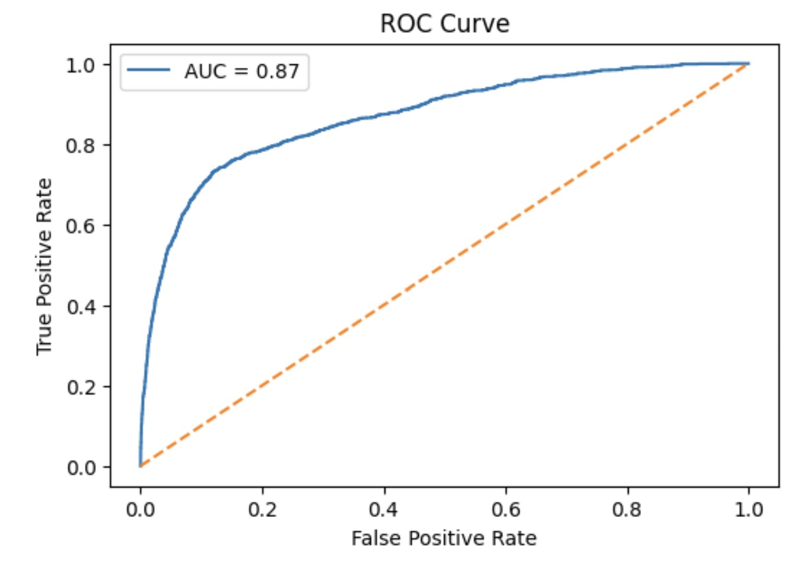
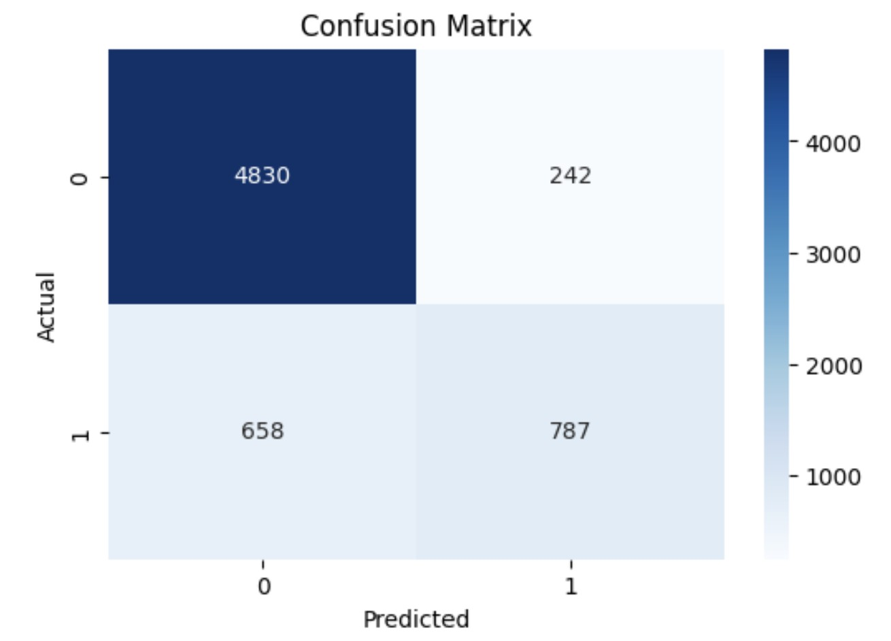
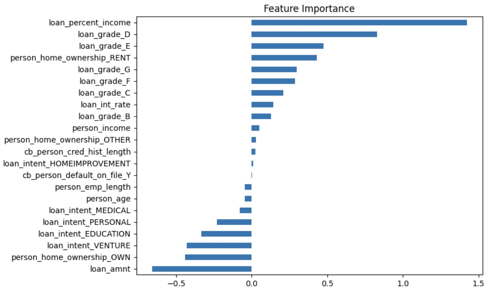

# Credit Risk Assessment using Machine Learning

## Overview
This project predicts loan default risk using Logistic Regression to help financial institutions identify high-risk applicants and reduce potential losses.

## Objectives
- Identify high-risk loan applicants  
- Reduce financial losses for lenders  

## Workflow
- Data Cleaning  
- Exploratory Data Analysis (EDA)  
- Feature Engineering  
- Model Building  
- Evaluation (Accuracy, ROC-AUC, Confusion Matrix)  

## Tools Used
- Python  
- Pandas  
- NumPy  
- Scikit-learn  
- Matplotlib & Seaborn  

## Results
- Achieved strong predictive performance (AUC ~0.87)  
- Identified key risk factors such as:  
  - Loan-to-income ratio  
  - Credit history  
  - Previous defaults  

## Business Impact
This model can assist financial institutions in making data-driven loan approval decisions and minimizing credit risk.

## Model Performance

### ROC Curve

### Confusion Matrix

### Feature Importance

## Key Insights
- Loan-to-income ratio is the strongest predictor of default  
- Customers with previous defaults show significantly higher risk  
- Model performs well but misses some defaulters, indicating scope for recall improvement  
